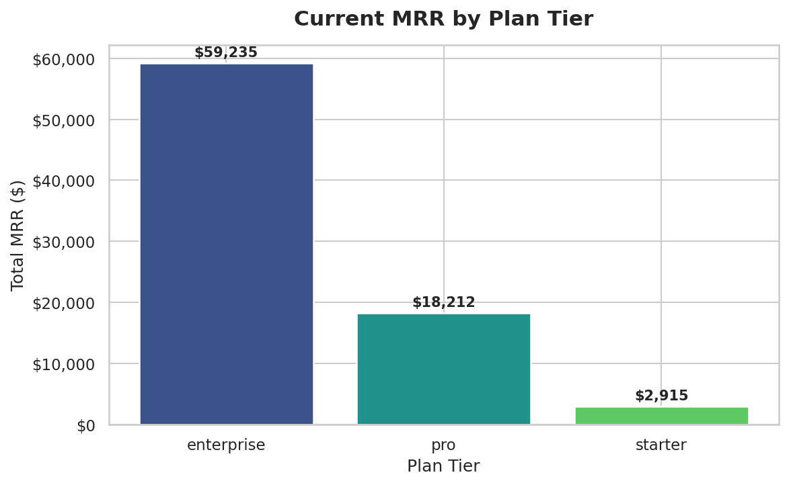
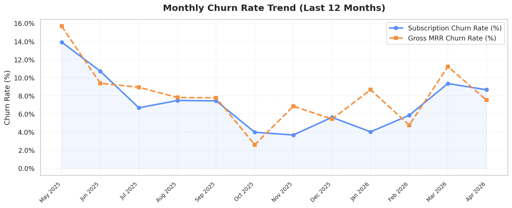
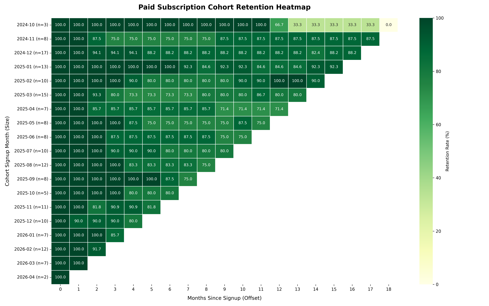
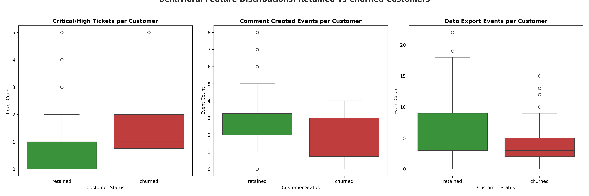

# SaaS Churn Analysis (SQL)

**Author:** Anuj Saini  
**Stack:** PostgreSQL · Python · pandas · seaborn  
**Data:** Synthetic SaaS subscription database (~19 monthly cohorts, April 2026 snapshot)

> **TL;DR:** Paid subscriber retention is strong (80%+ at 12 months), but churned customers show a +67% higher rate of urgent support tickets and 60%+ lower collaboration activity. The customer success team should act on behavioral signals first; the product team's month-3 engagement program comes second.

---

## Synthesis Recommendation

This project ran two parallel investigations in response to the same CFO question: *"Is churn getting worse, and what should we do about it?"*

| Investigation | What It Shows | Recommended Priority |
|---|---|---|
| [M3 – Cohort Retention](findings/03a_cohort_retention.md) | *When* churn happens (Month 3–4 cliff, consistent across all cohorts) | **2nd – Product team, Q3** |
| [M4 – Behavioral Predictors](findings/04b_predictors.md) | *Why* churn happens (support friction + low feature engagement) | **1st – CS team, now** |

**→ Full argument: [findings/05_synthesis.md](findings/05_synthesis.md)**  
**→ Three-line summary: [findings/00_executive_summary.md](findings/00_executive_summary.md)**

---

## Foundation – MRR & Churn Rate (M2)

Before either investigation, we locked down definitions and computed baseline metrics.

**Definitions used throughout this project:**
- **Active subscription:** status in `['active', 'paused', 'trial']` as of snapshot date
- **Churned subscription:** `status = 'churned'`

### Current MRR by Plan Tier



Premium accounts drive the majority of revenue. The MRR concentration in the top tier means that each churned premium customer has an outsized impact on revenue.

### Monthly Churn Rate Trend (Last 12 Months)



Subscription churn and MRR churn move in lockstep — no evidence of high-value customers churning disproportionately. Churn is broadly stable in the 2–5% range with no accelerating trend.

**Files:** [sql/02_foundation.sql](sql/02_foundation.sql) · [notebooks/02_foundation.ipynb](notebooks/02_foundation.ipynb)

---

## Investigation 1 – Cohort Retention (M3)

**Question:** Is churn getting worse over time, or is one bad cohort dragging the average?

**Answer:** Neither. Retention is consistently strong across all 19 cohorts. The only universal pattern is a 10–15% churn spike at Month 3–4 — a product-experience problem, not a cohort-quality problem.

### Cohort Retention Heatmap



*Rows = signup month cohort | Columns = months since signup | Values = % of original cohort still active*

Key observations:
- Month 1 retention is near-perfect (100%) across 18 of 19 cohorts — onboarding is working
- The Month 3–4 cliff is consistent and universal — this is the engagement gap to close
- Long-term retention flattens at ~85%+ after Month 4 — customers who survive are sticky

**Files:** [sql/03a_cohort_retention.sql](sql/03a_cohort_retention.sql) · [notebooks/03a_cohort_retention.ipynb](notebooks/03a_cohort_retention.ipynb) · [findings/03a_cohort_retention.md](findings/03a_cohort_retention.md)

---

## Investigation 2 – Behavioral Predictors (M4)

**Question:** What behaviours predict churn? Do churned and retained customers look different before they leave?

**Answer:** Yes — dramatically. Churned customers are defined by support escalation and low feature adoption. Retained customers are defined by collaboration and data usage.

| Signal | Churned | Retained | Δ |
|---|---|---|---|
| Urgent/critical tickets | Higher | Lower | **+67%** |
| Collaboration events | Lower | Higher | **+62%** |
| Data export events | Lower | Higher | **+58%** |

### Churned vs. Retained: Feature Distribution Comparison



The separation between churned and retained distributions is large enough to power a practical early-warning score — no ML required.

**Files:** [notebooks/04b_predictors.ipynb](notebooks/04b_predictors.ipynb) · [findings/04b_predictors.md](findings/04b_predictors.md)

---

## Repository Structure

```
SaaS-Churn/
├── sql/
│   ├── 02_foundation.sql          # MRR + churn rate definitions
│   └── 03a_cohort_retention.sql   # Per-cohort retention table
├── notebooks/
│   ├── 02_foundation.ipynb        # MRR & churn baselines
│   ├── 03a_cohort_retention.ipynb # Cohort heatmap
│   └── 04b_predictors.ipynb       # Behavioral feature engineering
├── findings/
│   ├── 00_executive_summary.md    # Three-takeaway summary
│   ├── 03a_cohort_retention.md    # M3 findings
│   ├── 04b_predictors.md          # M4 findings
│   └── 05_synthesis.md            # Which investigation to act on first
└── figures/
    ├── mrr_by_tier.png            # MRR breakdown bar chart
    ├── monthly_churn_trend.png    # 12-month churn rate trend
    ├── cohort_heatmap.png         # Retention heatmap (M3)
    └── predictor_comparison.png   # Churned vs retained (M4)
```

---

## Running the Notebooks

```bash
# 1. Clone the repo
git clone https://github.com/openlion711/saas-churn-analysis-sql.git
cd saas-churn-analysis-sql

# 2. Create a virtual environment
python3 -m venv venv
source venv/bin/activate

# 3. Install dependencies
pip install -r requirements.txt

# 4. Add your database credentials
cp .env.example .env  # edit with your Postgres connection string

# 5. Run notebooks
jupyter notebook notebooks/
```

---

*This project demonstrates the value of running parallel investigations and synthesising them into a single prioritised recommendation — rather than dumping every analysis on the stakeholder and asking them to decide.*
